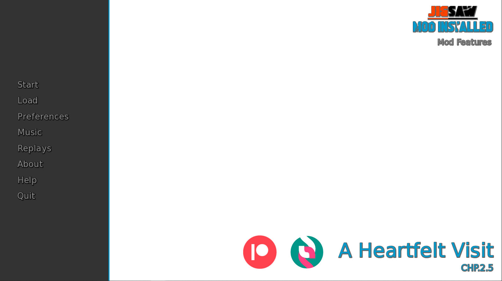

I have created a Multi-Mod with walkthrough for A Heartfelt Visit by [Secret Arcade](https://www.patreon.com/SecretArcade)

Mod Features:
  1. Walkthough with Suggestions. Not Really Required but just my best suggestions
  2. Customizable Quick Menu Position
  3. Custom Music Player with In-Game Overlay
  4. In-Game Mod shortcuts button "?" Just above Music Player Overlay
  5. Reinserted the Textbox background with the ability to change opacity.
  6. Toggle between standard Notifications of Stack Notifications
  7. Fadeable text with options to change to suit you preference
  8. Custom Savenames
  9. Hotkeys for choice menus

Every option can be toggled in preferences

Have tested that if you remove mod saves still work even if a save was made while the mod was installed.

The mod works without modifying any of the original files so theoretically it should not affect saves.

The other options should work without a hitch but will be tested on every release.

If a new version is released the walkthrough will be out of sync. But it will not affect the way the game
plays. None of the original files is touched.

If there is an internet connection available the mod will check if updates available.

Drop the contents into game folder

If the mod is installed correctly it will show on the main menu mod installed

The Current Mod Version is **CHP.2.5**
